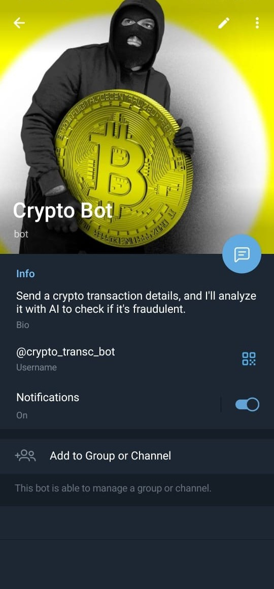
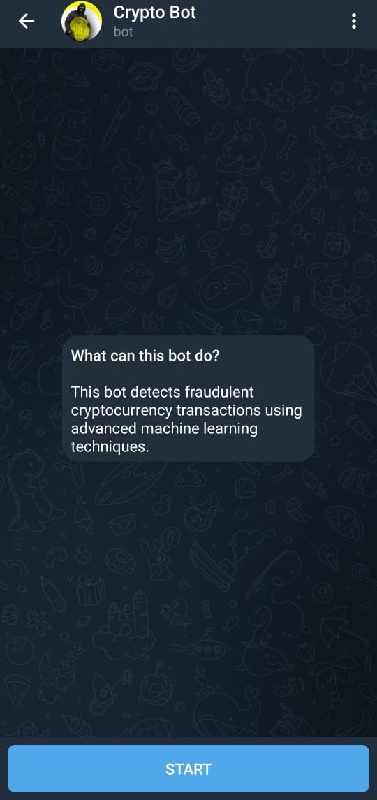
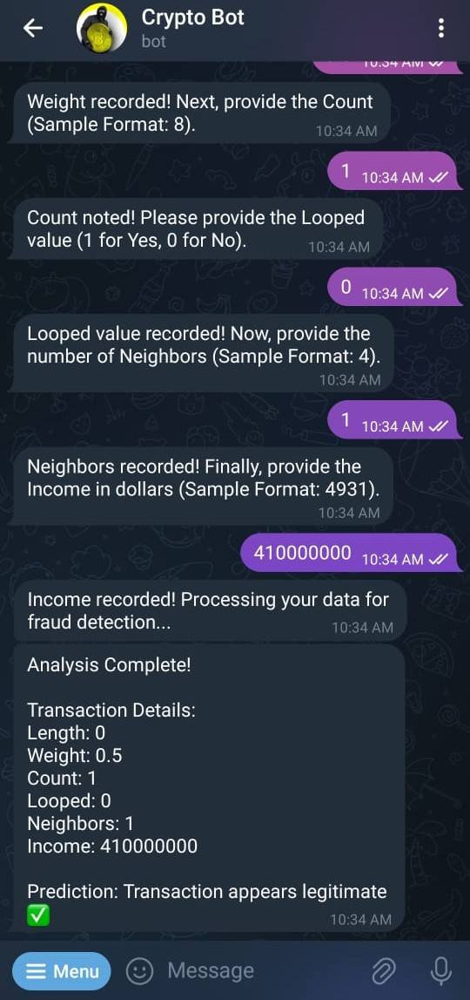
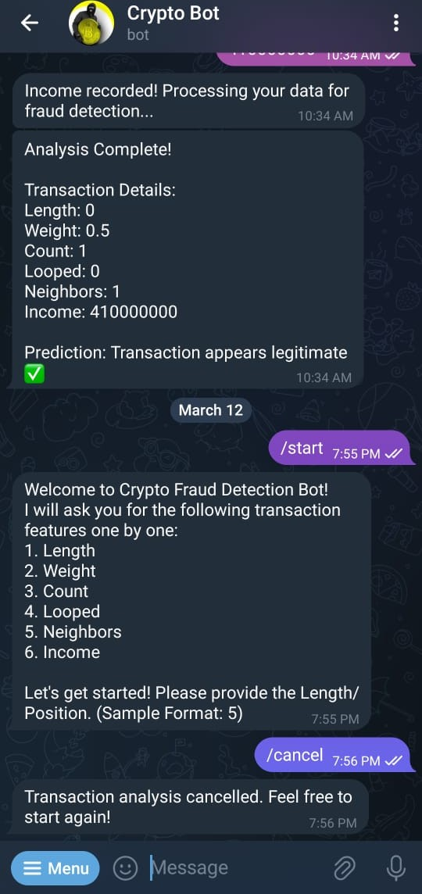

# Crypto Safety Bot

A real-time fraud detection Telegram bot that uses machine learning to predict the risk of cryptocurrency transactions. Users can input transaction features and receive instant fraud analysis powered by a predictive model trained on historical blockchain data.

## Table of Contents

- [Features](#features)
- [How It Works](#how-it-works)
- [Screenshots Preview](#screenshots-preview)
- [Tech Stack](#tech-stack)
- [Setup Instructions](#setup-instructions)
- [Author](#author)

## Features

ML Model Prediction – Trained to detect fraudulent transactions based on transaction metadata.<br>
Telegram Bot Interface – Users interact with the system via a friendly bot. Warning system for suspicious patterns.

## How It Works

1.  User starts the bot with /start.

2.  The bot collects 6 features:

        Length, Weight, Count, Looped, Neighbors, and Income.

3.  The input is standardized using a pre-trained scaler.pkl.

4.  Features are passed to the trained model.pkl for prediction.

5.  The bot responds with either:

        Legitimate Transaction or Fraudulent Transaction

## Screenshots Preview

<br><br>

<div align="center">
  
  <p><strong>Figure 1: </strong>About Page</p>
</div>

<br><br>

<div align="center">
  
  <p><strong>Figure 2: </strong>Home Page</p>
</div>

<br><br>

<div align="center">
  
  <p><strong>Figure 3: </strong>Legitimate Transaction Prediction</p>
</div>

<br><br>

<div align="center">
  
  <p><strong>Figure 4: </strong>Cancel Transaction</p>
</div>

<br><br>

## Tech Stack

Python – Core language  
Machine Learning (scikit-learn, pandas, joblib) - For model training and prediction
<br>
Telegram Bot API (python-telegram-bot) - To handle message polling and interactions

## Setup Instructions

### 1. Clone the repository

```bash
git clone https://github.com/your-username/crypto-safety-bot.git
cd crypto-safety-bot
```

### 2. Install dependencies

```bash
pip install -r requirements.txt
```

### 3. Create `.env` file

Inside the project root, create a `.env` file and add your bot credentials after creating your bot using Bot Father:

```env
TELEGRAM_TOKEN=your_token
TELEGRAM_USERNAME=@your_bot
```

> Never commit your `.env` file or share your token publicly.

### 4. Run the bot

```bash
python main.py
```

## Author

**Sudeep B**  
[LinkedIn](https://linkedin.com/in/thisissudeep)

---
