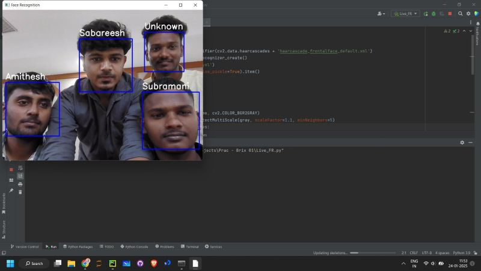

# Face Recognition System using OpenCV

A real-time Face Detection and Recognition System built with **Python** and **OpenCV**, leveraging **Haar Cascade** for detecting faces and **LBPH (Local Binary Patterns Histograms)** for recognizing them. This project identifies known individuals from a pre-trained dataset and flags unknown persons.

<strong>LinkedIn Project Post: </strong>[Click here](https://www.linkedin.com/posts/thisissudeep_python-computervision-opencv-activity-7290931300725665792-82Ip)


## Table of Contents

- [Features](#features)
- [How It Works](#how-it-works)
- [Screenshots](#screenshots)
- [Tech Stack](#tech-stack)
- [Setup Instructions](#setup-instructions)
- [Author](#author)


## Features

- Real-time face detection using Haar Cascade
- Face recognition using LBPH algorithm
- Displays the name of the recognized person on screen
- Flags unrecognized faces as `"Unknown"`
- Easy to retrain with new faces


## How It Works

1. **Dataset Creation**: Capture multiple face samples for each known individual.
2. **Training Phase**:
   - Faces are saved and labeled.
   - LBPH face recognizer is trained on the dataset.
3. **Recognition Phase**:
   - Haar Cascade detects the face in the webcam feed.
   - Trained model matches the face to known individuals.
   - Displays the person's name or "Unknown".


## Screenshots

<div align="center">
  
  <p><strong>Figure 1:</strong> Real-time face detection and recognition</p>
</div>


##  Tech Stack

- **Python** – Core programming language
- **OpenCV** – Image processing and face detection
- **NumPy** – Matrix operations
- **Haar Cascade** – Face detection algorithm
- **LBPH** – Face recognition model


## Setup Instructions

### 1. Clone the repository

```bash
git clone https://github.com/thisissudeep/face-recognition-system.git
cd face-recognition-system
```

### 2. Install dependencies

```bash
pip install opencv-python numpy
```

### 3. Dataset Preparation

- Run the dataset creation script:

```bash
python capture_faces.py
```

- Capture face samples.

### 4. Train the Model

```bash
python fr-training.py
```


### 5. Run Face Recognition

```bash
python main.py
```

- The webcam will open, and it will recognize known faces in real-time.


## Author

**Sudeep B**  
[LinkedIn](https://linkedin.com/in/thisissudeep)


---
