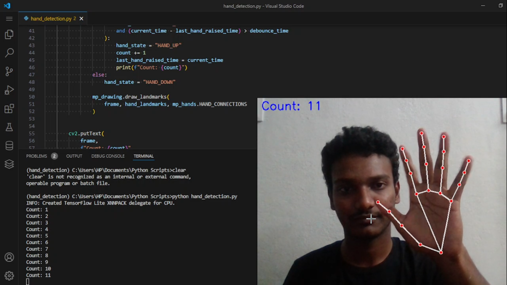

# Hand Raise Counter
A real-time hand raise detection system using OpenCV and MediaPipe that accurately counts hand raises using a debounce mechanism to avoid false positives. It uses OpenCV and Mediapipe Python Frameworks.

## Screenshot

<br><br>

<div align="center">
  
  <p><strong>Figure 1: </strong> Count</p>
</div>

<br><br>

## Features
- Detects hand gestures using Mediapipe.
- Counts the number of times a hand is raised.
- Provides a visual representation of the detected hand landmarks.
- Displays the count directly on the video feed.

## Prerequisites
- Python 3.7 or later
- OpenCV
- Mediapipe

## Installation

1. Clone the repository into your local system:
```bash
git clone https://github.com/your-username/hand-raise-counter.git
cd hand-raise-counter
```
   
2. Create a virtual environment (optional but recommended):
``` bash
python -m venv env
source env/bin/activate  # For Linux/macOS
env\Scripts\activate     # For Windows
Install the required dependencies:
```

3.Install the required dependencies:
``` bash
pip install -r requirements.txt
```
---