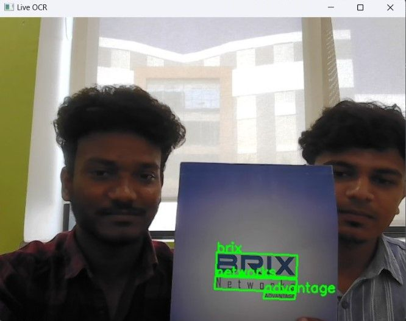
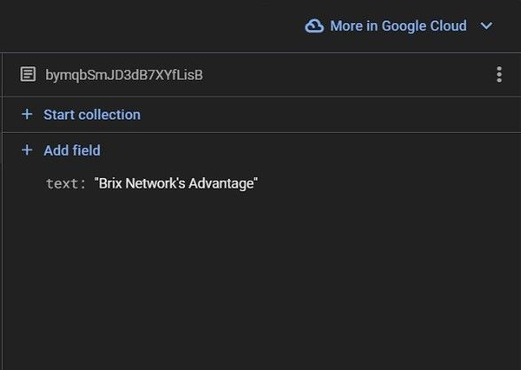

# OCR Processor with Gemini AI & Firebase

A real-time Optical Character Recognition (OCR) system that extracts text from live video or images, enhances it using the **Gemini API**, and stores the result in **Firebase Realtime Database**. It supports both static image input and live webcam feed, offering intelligent AI-enriched outputs.

<strong>LinkedIn Project Post:</strong> [Click here](https://www.linkedin.com/posts/thisissudeep_ocr-ai-computervision-activity-7300375951534698496-VfJW)

## Table of Contents

- [Features](#features)
- [How It Works](#how-it-works)
- [Screenshots](#screenshots)
- [Tech Stack](#tech-stack)
- [Setup Instructions](#setup-instructions)
- [Author](#author)

## Features

- **Image OCR** – Extract text from static images using Tesseract OCR.
- **Live OCR** – Process real-time text from video feed using Keras OCR.
- **AI Enhancement** – Beautify and structure extracted text via Gemini API.
- **Cloud Sync** – Store enhanced content directly in Firebase Realtime DB.

## How It Works

1. User runs the app via `main.py`
2. Selects mode: **Image OCR** or **Live Video OCR**
3. Image:
   - Processed via PyTesseract
   - QR codes decoded with pyzbar
4. Video:
   - Frames processed with Keras-OCR
5. Gemini AI:
   - Text and image passed for enhancement
6. Output saved to **Firebase Realtime Database**

## Screenshots

<br><br>

<div align="center">
  
  <p><strong>Figure 1: </strong> OCR</p>
</div>

<br><br>

<div align="center">
  
  <p><strong>Figure 2: </strong> Firebase</p>
</div>

<br><br>

## Tech Stack

- **Python** – Core programming language
- **OpenCV** – For live video capture and image processing
- **PyTesseract** – Image-based OCR engine
- **Keras-OCR** – Real-time text recognition from video
- **Gemini API** – For AI-based text enhancement
- **Firebase Admin SDK** – For storing data in Realtime DB
- **PIL / pyzbar** – For image handling and QR code reading

## Setup Instructions

### 1. Clone the repository

```bash
git clone https://github.com/thisissudeep/mini-projects-portfolio.git
cd mini-projects-portfolio/ocr-processor
```

### 2. Install dependencies

```bash
pip install -r requirements.txt
```

### 3. Configure Environment

- Replace your Gemini API key:

```python
GENAI_API_KEY = "YOUR_GEMINI_API_KEY"
```

- Set Tesseract path for your OS:

```python
pytesseract.pytesseract.tesseract_cmd = "YOUR_TESSERACT_OCR_PATH"
```

- Configure Firebase:

  - Go to [Firebase Console](https://console.firebase.google.com/)
  - Enable **Firestore** or **Realtime Database**
  - Download your `serviceAccountKey.json` and update:

```python
FIREBASE_CREDENTIALS_PATH = "FIREBASE_JSON_FILE_PATH"
```

### 4. Run the App

```bash
python main.py
```

## Author

**Sudeep B**  
[LinkedIn](https://linkedin.com/in/thisissudeep)

---

